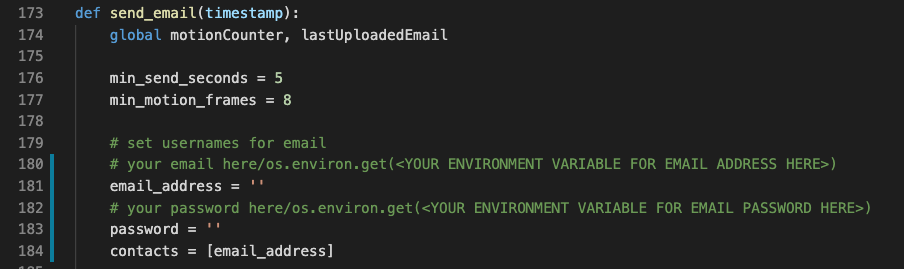
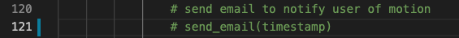
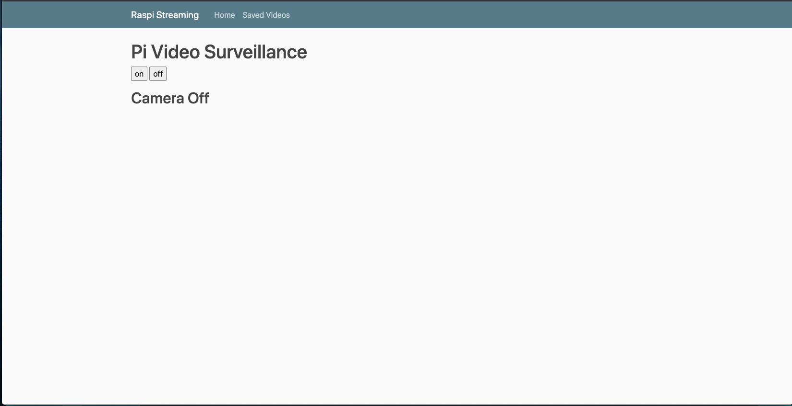

# Raspi-Streaming using Flask
A small flask server that streams video from a webcam/PiCamera.

## Requirements
To install all necessary packages: `pip install -r requirements.txt`

## Usage
If you would like to configure the app to send emails as well record video, please navigate to the `send_email()` function in the `webstreaming.py` file in the root directory. You will need to set up an app password so that this website can automatically send emails for you. Instructions to do so can be found here: https://support.google.com/accounts/answer/185833?hl=en

Finally, uncomment this line of code in the `detect_motion()` function to enable email sending.

If you do not want to enable this feature, just leave that line commented out.

From the root directory, run `python webstreaming.py --ip 0.0.0.0 --port 8000`. This will start the flask server.

Next, navigate to http://0.0.0.0:8000/ on the web browser of your choice.

You are now ready to start using the website!

Click on/off to toggle streaming:

The website will automatically record any motion that it detects.

Next, navigate to the `Saved Videos` page. You can view all recorded motion here.

## Credits

* Outline for website: https://www.pyimagesearch.com/2019/09/02/opencv-stream-video-to-web-browser-html-page/
* Recording video functionality (changed to start recording based on motion): https://www.pyimagesearch.com/2016/02/29/saving-key-event-video-clips-with-opencv/
